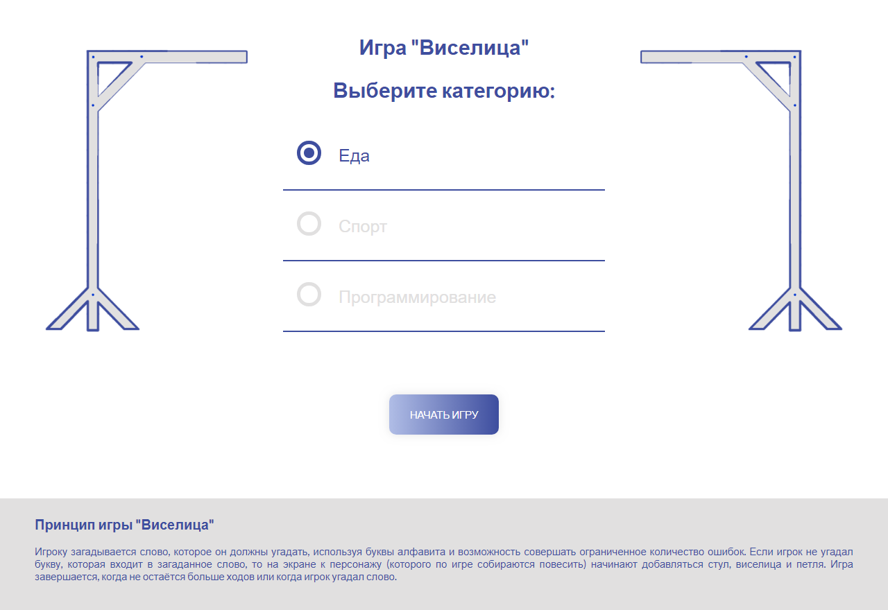
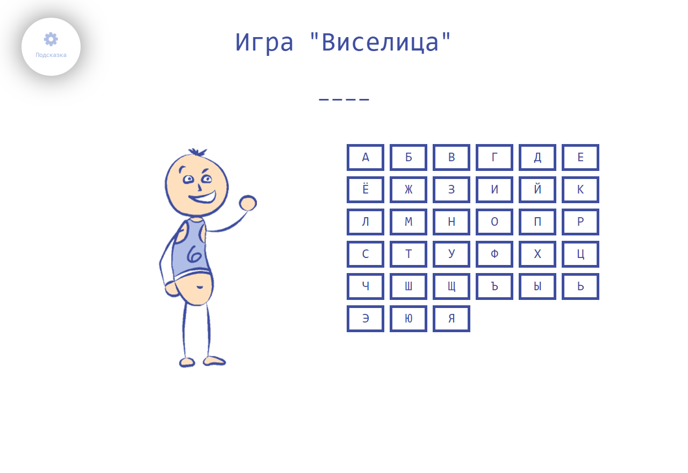

# Gallows
# `Принцип игры "Виселица"`
> Игроку загадывается слово, которое он должны угадать, используя буквы алфавита и возможность совершать ограниченное количество ошибок. Если игрок не угадал букву, которая входит в загаданное слово, то на экране к персонажу (которого по игре собираются повесить) начинают добавляться стул, виселица и петля. Игра завершается, когда не остаётся больше ходов или когда игрок угадал слово.
>
>> Играть онлайн: https:///olgafo.github.io/Gallows/
>>
>> JSDoc: https://olgafo.github.io/Gallows/JSDoc/
# `Иллюстрации к игре "Виселица"`

  
  

  

