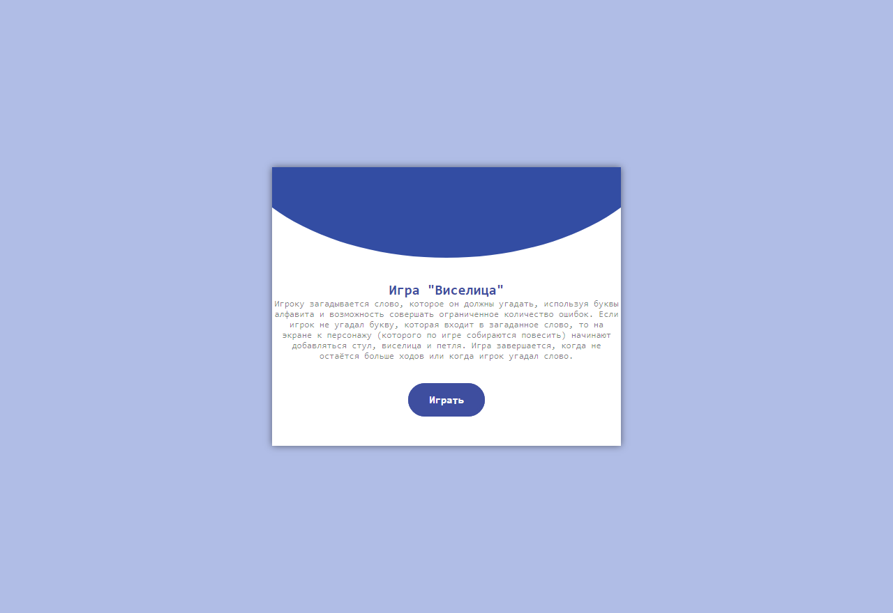

# Gallows
# `Принцип игры "Виселица"`
> Игроку загадывается слово, которое он должны угадать, используя буквы алфавита и возможность совершать ограниченное количество ошибок. Если игрок не угадал букву, которая входит в загаданное слово, то на экране к персонажу (которого по игре собираются повесить) начинают добавляться стул, виселица и петля. Игра завершается, когда не остаётся больше ходов или когда игрок угадал слово.
# `Иллюстрации к игре`

  
  > Стартовая страница
  
  > Главная страница

